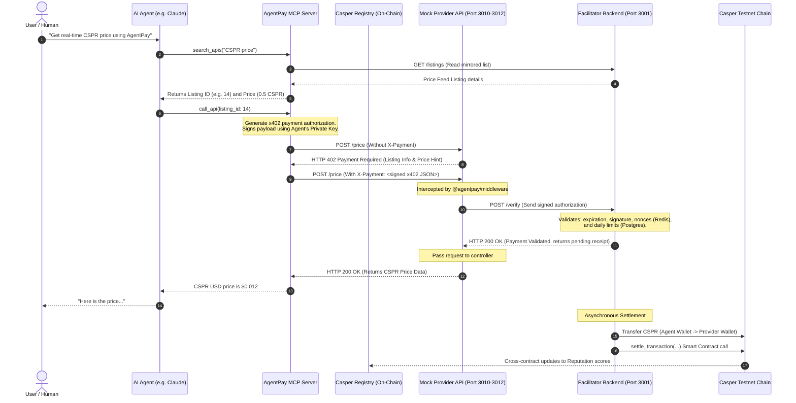

# AgentPay

> **Stripe for AI Agents** — payment infrastructure for the autonomous AI economy, built on the Casper Network.

AgentPay is a decentralized registry, reputation protocol, and micropayment gateway that lets AI agents discover, call, and pay for API services autonomously. No credit cards, no pre-negotiated subscriptions, and no human-in-the-loop required.

---

## 🚀 Key Features

* **x402 Micropayment Protocol**: Embeds cryptographic payment authorizations directly into standard HTTP headers (`X-Payment`). Gates API resources behind verified Casper testnet transactions.
* **On-Chain API Registry**: A decentralized service directory where providers register endpoints, categories, pricing, and rate-limits.
* **Autonomous Discovery & Access**: Exposes marketplace tools directly to LLMs through a Model Context Protocol (MCP) server.
* **Smart Contract Reputation Protocol**: Dynamically adjusts provider and agent reputation scores on-chain after every transaction settlement.
* **Comprehensive Web Dashboard**: Provides interactive exploration tools for the marketplace, a generated integration code panel, real-time transaction feeds, spending limits, whitelist toggles, and charts.

---

## 🏗️ Architecture & Interaction Flow

AgentPay is composed of 5 primary layers:
1. **Casper Smart Contracts (Odra/Rust)**: Core protocol logic for registry, reputation scoring, and payment records.
2. **Facilitator Backend (Node.js/Express)**: Orchestrates database sync, replay protection (Redis), validation checks, and off-chain-to-on-chain tx settlement.
3. **x402 Middleware (TypeScript/NPM package)**: Simple Express middleware that gates provider APIs.
4. **MCP Server (TypeScript)**: Standardized LLM tool-calling layer for agent search, payment, and details lookup.
5. **Next.js 15 Web Portal**: A beautiful interface for API discovery, metrics tracking, and agent wallet limit management.

### System Sequence Flowchart

The diagram below illustrates a complete discovery and consumption cycle where an AI agent pays for and consumes a gated API service:



---

## 📂 Repository Structure

```
agentpay/
├── contracts/       # Casper Smart Contracts (Odra/Rust)
│   ├── registry/    #   On-chain API listing and discovery
│   ├── reputation/  #   Provider and agent scoring
│   └── payment/     #   Settlement records and protocol fee
├── backend/         # Facilitator Backend (Node.js/Express)
│                    #   x402 verification, Redis nonce cache,
│                    #   PostgreSQL sync, Casper SDK integration
├── mcp-server/      # MCP Server (TypeScript)
│                    #   6 tools for agent discovery and payment
├── middleware/      # x402 Gating Middleware (NPM package)
│                    #   Drop-in Express middleware for providers
├── dashboard/       # Next.js 15 Web Application
│                    #   Marketplace, provider panel, developer console
├── demo/            # Mock providers + setup scripts
│                    #   3 pre-registered APIs for testing
└── keys/            # Test wallet keys (testnet only)
```

---

## ⚡ Contract Details (Casper Testnet)

* **Registry**: `contract-package-d9b87e7ea424d3e93bcde9487f842636184eb2bbb9f10b3377dc7f74a90595f3` ([deploy transaction](https://testnet.cspr.live/transaction/d5f468537557371c32cfd7e23455f6e0802a3b41cb2f7eae486bd753518a31a6))
* **Reputation**: `contract-package-56a5fcd172ac50c3cc06fe555fb9806409fde2c012f146803a9afc33b7d397e5` ([deploy transaction](https://testnet.cspr.live/transaction/6741965c75ef5eab22b3d9e8f988d3be4c494767055ac39d3128077a5dbcb42d))
* **Payment**: `contract-package-1febe8793989be4da5f83d3313b60143f2d12063688702bedc19722feb4cae25` ([deploy transaction](https://testnet.cspr.live/transaction/278bb5ca7cb062c141f7921f9564ae899c5fd7686f6b9740ffaa77c8ed8a95e6))

---

## 🛠️ Local Installation & Startup

Follow this sequence to run the entire system locally:

### 1. Prerequisites & Environment Setup
Make sure you have a running PostgreSQL database (e.g. Supabase) and a Redis instance (e.g. Upstash Redis). Configure the `.env` files in:
* `backend/.env` (using `backend/.env.example` as a template)
* `demo/.env` (using `demo/.env.example` as a template)
* `mcp-server/.env` (using `mcp-server/.env.example` as a template)

### 2. Start the Backend Facilitator
```bash
cp backend/.env.example backend/.env
cp demo/.env.example demo/.env
cp mcp-server/.env.example mcp-server/.env
```

### Step 2 — Start the backend
```bash
cd backend && npm install && npm run dev
```

### Step 3 — Seed the database and start mock providers
```bash
cd demo && npm install && npm run setup
```
Note the listing IDs printed. Verify they match the IDs in `demo/.env`, then start the mock APIs:
```bash
cd mcp-server
npm install
npm run dev
```

---

## 🧪 Testing and Verification

### Automated Gating Verification
Run this to ensure the provider middleware correctly blocks calls without payment headers and parses expected 402 parameters:
```bash
cd dashboard && npm install && npm run dev
# Open http://localhost:3000
```

### Step 5 — Start the MCP server
```bash
cd mcp-server && npm install && npm run dev
```

---

## Integrating with Claude Desktop (Autonomous Flow)

To watch Claude Desktop automatically call the APIs using AgentPay:

1. Locate your configuration file on Windows: `%APPDATA%\Claude\claude_desktop_config.json`
2. Add the following entry:
   ```json
   {
     "mcpServers": {
       "agentpay": {
         "command": "npx",
         "args": ["tsx", "C:/path/to/agentpay/mcp-server/src/index.ts"],
         "env": {
           "AGENT_WALLET_ADDRESS": "your_agent_wallet_hash",
           "AGENT_WALLET_PRIVATE_KEY_PATH": "C:/path/to/agentpay/keys/agent_secret_key.pem",
           "AGENTPAY_BACKEND_URL": "http://localhost:3001",
           "CASPER_NETWORK": "casper-test"
         }
       }
     }
   }
   ```
3. Restart Claude Desktop.
4. Ask: *"Search AgentPay for a price feed, find the price of CSPR, and tell me what it is."*

Watch Claude execute the tool calls, query the gated endpoint, trigger on-chain transfers, and return the result autonomously!

---

## Verification

### Middleware gating (confirms 402 enforcement works)
```bash
cd demo && npm run verify:day10
```
Sends requests with and without payment headers. Verifies the middleware correctly blocks unpaid calls and parses the 402 response parameters.

### MCP tools (confirms all 6 tools work end-to-end)
```bash
cd mcp-server && npm run verify:day9
```
Runs discovery, balance checking, and signing payload creation across all tools. Confirms the full agent flow without needing Claude Desktop.

### On-chain contract state
```bash
export ODRA_CASPER_LIVENET_NODE_ADDRESS=https://node.testnet.casper.network
export ODRA_CASPER_LIVENET_CHAIN_NAME=casper-test
export ODRA_CASPER_LIVENET_SECRET_KEY_PATH=../../keys/deployer_secret_key.pem

cd contracts/registry
cargo run --bin registry_cli -- contract Registry get_listing --listing_id 1
```
Query any listing directly from the Casper testnet chain.

---

## Screenshots


---

## Vision

AgentPay is not a niche DeFi product. It is foundational infrastructure — in the same category as Stripe (payment processing) or Twilio (communication APIs). Every AI agent that needs external data or services is a potential user. Every data provider or API company that wants to monetize at micro-scale is a potential supplier.

The x402 protocol launches on Casper in June 2026. AgentPay is one of the first live production implementations. The timing is deliberate: we are positioning at the exact moment this market becomes real.

**The long-term vision:** AgentPay becomes the default economic layer for the autonomous AI economy, the infrastructure through which millions of agents transact with millions of providers, every second, all settled on Casper. The 0.5% protocol fee means Casper's growth and AgentPay's revenue grow together.

---

## Built For

**Casper Agentic Buildathon 2026** · Hosted by Casper Association on DoraHacks

---

*AgentPay — because autonomous agents deserve autonomous payments.*