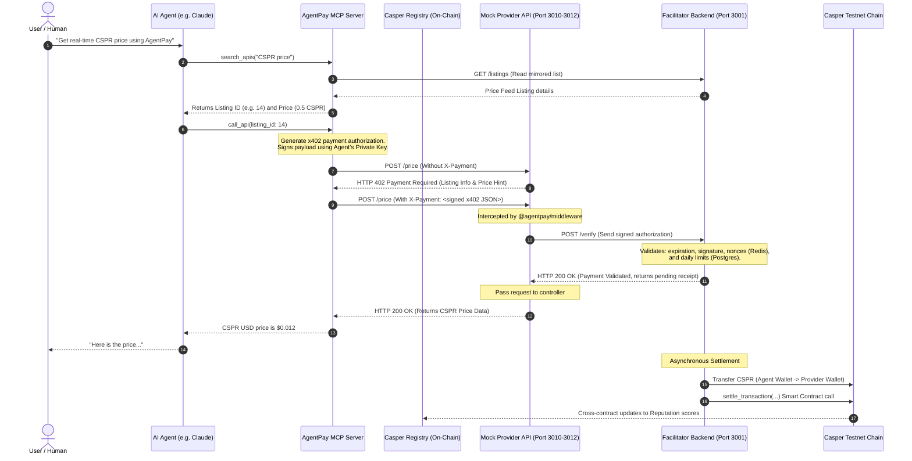

# AgentPay

> **Stripe for AI Agents** — payment infrastructure for the autonomous AI economy, built on the Casper Network.

AgentPay is a decentralized registry, reputation protocol, and micropayment gateway that lets AI agents discover, call, and pay for API services autonomously. No credit cards, no pre-negotiated subscriptions, and no human-in-the-loop required.

---

## 🚀 Key Features

* **x402 Micropayment Protocol**: Embeds cryptographic payment authorizations directly into standard HTTP headers (`X-Payment`). Gates API resources behind verified Casper testnet transactions.
* **On-Chain API Registry**: A decentralized service directory where providers register endpoints, categories, pricing, and rate-limits.
* **Autonomous Discovery & Access**: Exposes marketplace tools directly to LLMs through a Model Context Protocol (MCP) server.
* **Smart Contract Reputation Protocol**: Dynamically adjusts provider and agent reputation scores on-chain after every transaction settlement.
* **Comprehensive Web Dashboard**: Provides interactive exploration tools for the marketplace, a generated integration code panel, real-time transaction feeds, spending limits, whitelist toggles, and charts.

---

## 🏗️ Architecture & Interaction Flow

AgentPay is composed of 5 primary layers:
1. **Casper Smart Contracts (Odra/Rust)**: Core protocol logic for registry, reputation scoring, and payment records.
2. **Facilitator Backend (Node.js/Express)**: Orchestrates database sync, replay protection (Redis), validation checks, and off-chain-to-on-chain tx settlement.
3. **x402 Middleware (TypeScript/NPM package)**: Simple Express middleware that gates provider APIs.
4. **MCP Server (TypeScript)**: Standardized LLM tool-calling layer for agent search, payment, and details lookup.
5. **Next.js 15 Web Portal**: A beautiful interface for API discovery, metrics tracking, and agent wallet limit management.

### System Sequence Flowchart

The diagram below illustrates a complete discovery and consumption cycle where an AI agent pays for and consumes a gated API service:



---

## 📂 Repository Structure

```
agentpay/
├── contracts/          # Casper Smart Contracts (Odra/Rust): Registry, Reputation, Payment
├── backend/            # Facilitator Backend & Faucet API (Node.js/Express)
├── mcp-server/         # Model Context Protocol Server (TypeScript)
├── middleware/         # Express x402 Gating Middleware (TypeScript NPM package)
├── dashboard/          # Next.js 15 Web Application (Developer & Provider Dashboards)
├── demo/               # Mock API providers, verification, and database setup scripts
└── keys/               # Developer, Provider, Agent, and Facilitator keys for local tests
```

---

## ⚡ Contract Details (Casper Testnet)

* **Registry**: `contract-package-d9b87e7ea424d3e93bcde9487f842636184eb2bbb9f10b3377dc7f74a90595f3` ([deploy transaction](https://testnet.cspr.live/transaction/d5f468537557371c32cfd7e23455f6e0802a3b41cb2f7eae486bd753518a31a6))
* **Reputation**: `contract-package-56a5fcd172ac50c3cc06fe555fb9806409fde2c012f146803a9afc33b7d397e5` ([deploy transaction](https://testnet.cspr.live/transaction/6741965c75ef5eab22b3d9e8f988d3be4c494767055ac39d3128077a5dbcb42d))
* **Payment**: `contract-package-1febe8793989be4da5f83d3313b60143f2d12063688702bedc19722feb4cae25` ([deploy transaction](https://testnet.cspr.live/transaction/278bb5ca7cb062c141f7921f9564ae899c5fd7686f6b9740ffaa77c8ed8a95e6))

---

## 🛠️ Local Installation & Startup

Follow this sequence to run the entire system locally:

### 1. Prerequisites & Environment Setup
Make sure you have a running PostgreSQL database (e.g. Supabase) and a Redis instance (e.g. Upstash Redis). Configure the `.env` files in:
* `backend/.env` (using `backend/.env.example` as a template)
* `demo/.env` (using `demo/.env.example` as a template)
* `mcp-server/.env` (using `mcp-server/.env.example` as a template)

### 2. Start the Backend Facilitator
```bash
cd backend
npm install
npm run dev
```

### 3. Seed Database & Run Mock Providers
If you need to seed listings into your database for the first time, run the setup script:
```bash
cd demo
npm install
npm run setup
```
This will print listing IDs. Verify they match `PRICE_FEED_LISTING_ID`, `YIELD_DATA_LISTING_ID`, and `SUMMARIZER_LISTING_ID` in `demo/.env`.

Once configured, run the mock APIs:
```bash
# In three separate terminals inside the /demo directory:
npm run price-feed
npm run yield-data
npm run summarizer
```

### 4. Run the Next.js Dashboard
```bash
cd dashboard
npm install
npm run dev
```
Open [http://localhost:3000](http://localhost:3000) to view the client-facing UI.

### 5. Start the MCP Server
```bash
cd mcp-server
npm install
npm run dev
```

---

## 🧪 Testing and Verification

### Automated Gating Verification
Run this to ensure the provider middleware correctly blocks calls without payment headers and parses expected 402 parameters:
```bash
cd demo
npm run verify:day10
```

### Automated MCP Tools Verification
Run this to verify the discovery, balance checking, and signing payload creation across the 6 MCP tools:
```bash
cd mcp-server
npm run verify:day9
```

### On-Chain Contract Checks
Verify state directly on-chain using CLI contract queries:
```bash
# Set parameters
export ODRA_CASPER_LIVENET_NODE_ADDRESS=https://node.testnet.casper.network
export ODRA_CASPER_LIVENET_CHAIN_NAME=casper-test
export ODRA_CASPER_LIVENET_SECRET_KEY_PATH=../../keys/deployer_secret_key.pem

# Registry: Read registered API
cd contracts/registry
cargo run --bin registry_cli -- contract Registry get_listing --listing_id 1
```

---

## 🤖 Integrating with Claude Desktop (Autonomous Flow)

To watch Claude Desktop automatically call the APIs using AgentPay:

1. Locate your configuration file on Windows: `%APPDATA%\Claude\claude_desktop_config.json`
2. Add the following entry:
   ```json
   {
     "mcpServers": {
       "agentpay": {
         "command": "npx",
         "args": [
           "tsx",
           "C:/path/to/agentpay/mcp-server/src/index.ts"
         ],
         "env": {
           "AGENT_WALLET_ADDRESS": "f6df2b9fc09d2b5f25af65faf36bc3bc4a6537597cc0181f9a2e1458cde387e3",
           "AGENT_WALLET_PRIVATE_KEY_PATH": "C:/path/to/agentpay/keys/agent_secret_key.pem",
           "AGENTPAY_BACKEND_URL": "http://localhost:3001",
           "CASPER_NETWORK": "casper-test"
         }
       }
     }
   }
   ```
3. Restart Claude Desktop.
4. Ask: *"Search AgentPay for a price feed, find the price of CSPR, and tell me what it is."*

Watch Claude execute the tool calls, query the gated endpoint, trigger on-chain transfers, and return the result autonomously!
