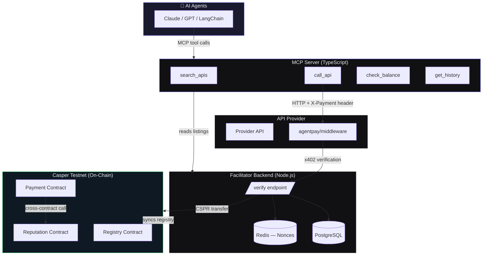
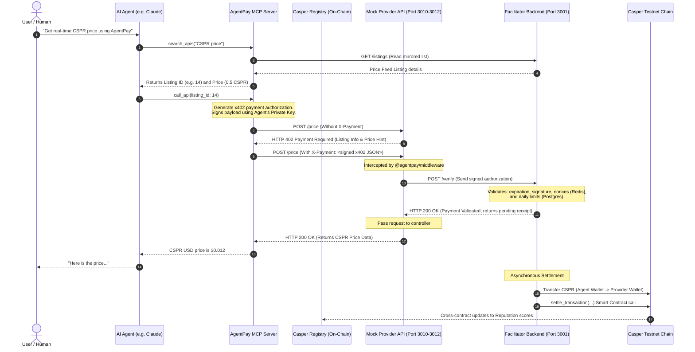

# AgentPay

**Payment infrastructure for the autonomous AI economy, built on Casper Network.**

> AI agents can reason, plan, and act. But they can't pay for anything. AgentPay fixes that.

[](https://testnet.cspr.live)
[](https://odra.dev)
[](https://modelcontextprotocol.io)
[](https://x402.org)
[](LICENSE)

---

## The Problem

Every AI agent running in production today hits the same wall: **it cannot pay for things.**

When an agent needs to call a paid API, a price feed, a compliance checker, a data enrichment service, the payment infrastructure forces a human back into the loop. Someone has to create an account, enter a credit card, generate an API key, and manage a monthly subscription. The agent borrows a human's identity and credentials to do its job.

This creates three broken patterns:

- **Subscription waste.** Companies buy $500/mo plans for APIs their agents call 3 times a month or get rate-limited when they need 50,000 calls.
- **No true micropayments.** Stripe charges $0.30 + 2.9% per transaction. For a $0.001 API call, that fee is 30,000% of the transaction value. True pay-per-use is commercially impossible on traditional rails.
- **No agent identity.** There is no concept of "this specific agent, authorized to spend up to $X/day, on behalf of company Y." Agents have no financial identity of their own.

The result: the autonomous AI economy is being strangled at birth by payment infrastructure that was never designed for it.

---

## The Solution

AgentPay is a decentralized marketplace and payment protocol that lets AI agents **discover, call, and pay for APIs autonomously** with no human in the loop, no pre-negotiated contracts, and no subscription overhead.

**How it works in one sentence:** An AI agent holds a Casper wallet, discovers services through an on-chain registry via MCP, and pays per request using the x402 micropayment protocol with cryptographic proof of payment embedded directly in the HTTP request header.

The whole thing discovery, payment authorization, API call, and on-chain settlement happens in under 500ms.

---

## Live Demo

> Watch Claude Desktop autonomously find a price feed, pay for it with CSPR, and return the result with zero human involvement and on-chain proof of every transaction.

**[▶ Watch the full demo on YouTube](https://youtu.be/xhCBGg1r7dg)**

---

## Deployed Contracts (Casper Testnet)

All marketplace logic is trustless and lives on-chain. No central authority controls the registry, reputation scores, or payment records.

| Contract | Address | Deploy Tx |
|----------|---------|-----------|
| **Registry** | `contract-package-d9b87e7...595f3` | [View on Explorer ↗](https://testnet.cspr.live/transaction/d5f468537557371c32cfd7e23455f6e0802a3b41cb2f7eae486bd753518a31a6) |
| **Reputation** | `contract-package-56a5fcd...397e5` | [View on Explorer ↗](https://testnet.cspr.live/transaction/6741965c75ef5eab22b3d9e8f988d3be4c494767055ac39d3128077a5dbcb42d) |
| **Payment** | `contract-package-1febe87...cae25` | [View on Explorer ↗](https://testnet.cspr.live/transaction/278bb5ca7cb062c141f7921f9564ae899c5fd7686f6b9740ffaa77c8ed8a95e6) |

---

## How AgentPay Works

### For API Providers

1. **List once.** Register your API endpoint on-chain — name, description, price per call in CSPR, category, rate limit. No billing system to build. No contracts to sign.
2. **Install the middleware.** Add one npm package in front of your existing API. It intercepts requests, verifies x402 payment proofs, and passes through paid calls.
3. **Get paid per call.** CSPR lands in your wallet automatically after every verified request. Your reputation score grows on-chain with every successful response.

### For Agent Developers

1. **Fund a wallet.** Create a Casper wallet for your agent. Set a daily spending limit. Deposit CSPR. That's the only setup step.
2. **Connect the MCP server.** One line of config. Your agent can now search, compare, and call any registered API using natural language.
3. **Walk away.** The agent discovers what it needs, pays for it autonomously, and never exceeds the limit you set. You check the dashboard occasionally. You never touch an API key again.

### The Payment Flow

When an agent calls a provider API through AgentPay, this is what happens in a single HTTP round-trip:

```
Agent decides it needs data
  → Queries AgentPay MCP: "find me a CSPR price feed"
  → MCP returns ranked provider list (by reputation + price)
  → Agent calls the chosen endpoint with X-Payment header:
     { from: agent_wallet, to: provider_wallet, amount: 500_motes,
       nonce: uuid, expires_at: +30s, signature: ed25519_sig }
  → Provider middleware sends payment to facilitator for verification
  → Facilitator checks: signature ✓ | nonce fresh ✓ | balance ✓ | limit ✓
  → Provider API responds with data
  → Agent gets its answer
  → CSPR settles on-chain in background (~10s)
  → Reputation contracts update for both agent and provider
```

Total time experienced by the agent: **under 500ms.**

---

## System Architecture

AgentPay is composed of five layers:



### Sequence Diagram



---

## Key Features

### x402 Micropayment Protocol
HTTP-native payment standard. A cryptographically signed payment authorization is embedded directly into the `X-Payment` request header. No transaction round-trip before the API call, payment proof travels with the request. Replay protection via Redis-backed nonce cache. Optimistic settlement means agents experience no latency.

### On-Chain API Registry
Providers register endpoints, descriptions, pricing, and rate limits directly on Casper using the Registry contract (Odra/Rust). The registry is public, permissionless, and immutable. No platform gatekeeping. Any provider can list. Any agent can query.

### Reputation Protocol
Every settled transaction updates both the provider's and agent's on-chain reputation score. Scores track: total calls, success rate, uptime, and payment history. Providers with higher reputation rank higher in agent search results. Agents with strong payment history unlock better rates. The market self-organizes, no central authority decides who is trustworthy.

### MCP Server (6 Tools)
Any MCP-compatible agent framework (Claude, LangChain, AutoGPT) can connect with one config entry. Tools exposed:
- `search_apis` — discover providers by natural language query, category, reputation, price
- `call_api` — make a paid API call with automatic x402 payment handling
- `get_api_details` — full provider details including reputation and sample response
- `check_balance` — agent wallet balance and daily spend remaining
- `get_transaction_history` — full payment history for audit and debugging
- `compare_providers` — side-by-side comparison of multiple listings

### Enforced Spending Limits
Agent wallets operate under developer-configured daily spending limits enforced at the facilitator level before any payment is authorized. Agents can never overspend. Limits are adjustable from the dashboard without touching any contract.

### Business Model
AgentPay takes a **0.5% protocol fee** on every transaction, collected automatically by the Payment smart contract. No sales team. No invoicing. Revenue scales directly with agent commerce volume on the platform.

---

## Repository Structure

```
agentpay/
├── contracts/       # Casper Smart Contracts (Odra/Rust)
│   ├── registry/    #   On-chain API listing and discovery
│   ├── reputation/  #   Provider and agent scoring
│   └── payment/     #   Settlement records and protocol fee
├── backend/         # Facilitator Backend (Node.js/Express)
│                    #   x402 verification, Redis nonce cache,
│                    #   PostgreSQL sync, Casper SDK integration
├── mcp-server/      # MCP Server (TypeScript)
│                    #   6 tools for agent discovery and payment
├── middleware/      # x402 Gating Middleware (NPM package)
│                    #   Drop-in Express middleware for providers
├── dashboard/       # Next.js 15 Web Application
│                    #   Marketplace, provider panel, developer console
├── demo/            # Mock providers + setup scripts
│                    #   3 pre-registered APIs for testing
└── keys/            # Test wallet keys (testnet only)
```

---

## Tech Stack

| Layer | Technology |
|-------|-----------|
| Smart Contracts | Rust + Odra Framework → Casper WASM |
| Backend | Node.js, TypeScript, Express |
| Database | PostgreSQL (Supabase) + Redis (Upstash) |
| MCP Server | TypeScript + `@modelcontextprotocol/sdk` |
| Middleware | TypeScript NPM package |
| Frontend | Next.js 15, Tailwind CSS |
| Blockchain SDK | `casper-js-sdk` |
| Payments | x402 Protocol over HTTP |

---

## Local Setup

### Prerequisites
- Node.js 20+
- Rust + `wasm32-unknown-unknown` target
- PostgreSQL instance (Supabase free tier works)
- Redis instance (Upstash free tier works)
- Casper Wallet browser extension

### Step 1 — Environment
Copy and fill the env files:
```bash
cp backend/.env.example backend/.env
cp demo/.env.example demo/.env
cp mcp-server/.env.example mcp-server/.env
```

### Step 2 — Start the backend
```bash
cd backend && npm install && npm run dev
```

### Step 3 — Seed the database and start mock providers
```bash
cd demo && npm install && npm run setup
```
Note the listing IDs printed. Verify they match the IDs in `demo/.env`, then start the mock APIs:
```bash
# Three separate terminals, all inside /demo
npm run price-feed    # Port 3010 — CSPR/USD price feed
npm run yield-data    # Port 3011 — DeFi yield rates
npm run summarizer    # Port 3012 — Text summarization
```

### Step 4 — Start the dashboard
```bash
cd dashboard && npm install && npm run dev
# Open http://localhost:3000
```

### Step 5 — Start the MCP server
```bash
cd mcp-server && npm install && npm run dev
```

---

## Integrating with Claude Desktop (Autonomous Flow)

To watch Claude Desktop automatically call the APIs using AgentPay:

1. Locate your configuration file on Windows: `%APPDATA%\Claude\claude_desktop_config.json`
2. Add the following entry:
   ```json
   {
     "mcpServers": {
       "agentpay": {
         "command": "npx",
         "args": ["tsx", "C:/path/to/agentpay/mcp-server/src/index.ts"],
         "env": {
           "AGENT_WALLET_ADDRESS": "your_agent_wallet_hash",
           "AGENT_WALLET_PRIVATE_KEY_PATH": "C:/path/to/agentpay/keys/agent_secret_key.pem",
           "AGENTPAY_BACKEND_URL": "http://localhost:3001",
           "CASPER_NETWORK": "casper-test"
         }
       }
     }
   }
   ```
3. Restart Claude Desktop.
4. Ask: *"Search AgentPay for a price feed, find the price of CSPR, and tell me what it is."*

Watch Claude execute the tool calls, query the gated endpoint, trigger on-chain transfers, and return the result autonomously!

---

## Verification

### Middleware gating (confirms 402 enforcement works)
```bash
cd demo && npm run verify:day10
```
Sends requests with and without payment headers. Verifies the middleware correctly blocks unpaid calls and parses the 402 response parameters.

### MCP tools (confirms all 6 tools work end-to-end)
```bash
cd mcp-server && npm run verify:day9
```
Runs discovery, balance checking, and signing payload creation across all tools. Confirms the full agent flow without needing Claude Desktop.

### On-chain contract state
```bash
export ODRA_CASPER_LIVENET_NODE_ADDRESS=https://node.testnet.casper.network
export ODRA_CASPER_LIVENET_CHAIN_NAME=casper-test
export ODRA_CASPER_LIVENET_SECRET_KEY_PATH=../../keys/deployer_secret_key.pem

cd contracts/registry
cargo run --bin registry_cli -- contract Registry get_listing --listing_id 1
```
Query any listing directly from the Casper testnet chain.

---

## Screenshots


---

## Vision

AgentPay is not a niche DeFi product. It is foundational infrastructure — in the same category as Stripe (payment processing) or Twilio (communication APIs). Every AI agent that needs external data or services is a potential user. Every data provider or API company that wants to monetize at micro-scale is a potential supplier.

The x402 protocol launches on Casper in June 2026. AgentPay is one of the first live production implementations. The timing is deliberate: we are positioning at the exact moment this market becomes real.

**The long-term vision:** AgentPay becomes the default economic layer for the autonomous AI economy, the infrastructure through which millions of agents transact with millions of providers, every second, all settled on Casper. The 0.5% protocol fee means Casper's growth and AgentPay's revenue grow together.

---

## Built For

**Casper Agentic Buildathon 2026** · Hosted by Casper Association on DoraHacks

---

*AgentPay — because autonomous agents deserve autonomous payments.*