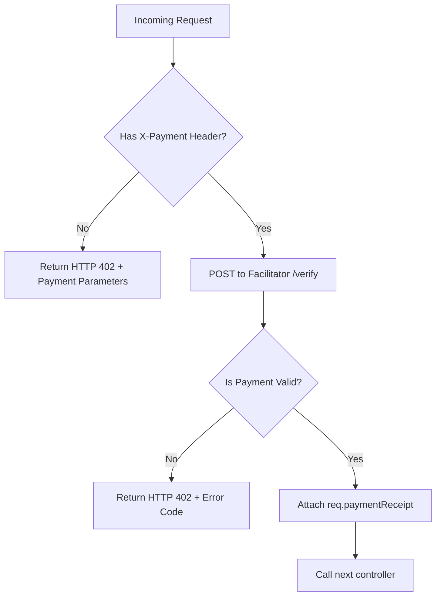

# @agentpay/middleware

> **Express middleware that enforces x402 micropayment verification on any route.**

Gate your API endpoints behind autonomous blockchain micropayments. Any client (AI agent, developer, or tool) that sends a valid signed `X-Payment` header is authorized to access the endpoint; otherwise, the middleware interceptor rejects the request with an `HTTP 402 Payment Required` response containing the payment parameters required to call the API.

---

## 🏗️ How Gating Works

The middleware acts as a gatekeeper in front of your controllers, communicating directly with the AgentPay Facilitator Backend to verify signatures and state.



---

## 📦 Installation

To import this into your project, install the middleware from the monorepo workspace:

```bash
cd middleware
npm install
```

---

## 🚀 Quick Integration Example

Integrate the middleware into your Express routers in seconds:

```typescript
import express from 'express';
import { agentPayMiddleware } from '@agentpay/middleware';

const app = express();
app.use(express.json());

app.post('/price', agentPayMiddleware({
  listing_id: 14,                             // Your Registry Listing ID
  provider_wallet: '832467189c656e3a7...',     // Provider account hash (bare hex)
  facilitator_url: 'http://localhost:3001',   // AgentPay facilitator endpoint
  expected_price_motes: '500000000',           // Required fee per call (0.5 CSPR)
}), (req, res) => {
  // Access verified payment receipt metadata:
  const receipt = req.paymentReceipt;
  console.log(`Verified tx hash: ${receipt.tx_hash}`);
  
  res.json({ price: 0.0124, currency: 'USD', asset: 'CSPR' });
});
```

---

## 🛠️ Verification Response Formats

### 1. Payment Required (No Header)
If a client hits the endpoint without an `X-Payment` header, the middleware intercepts it and returns a `402 Payment Required` status with the following body:

```json
{
  "error": "payment_required",
  "listing_id": 14,
  "price_motes": "500000000",
  "provider_wallet": "832467189c656e3a73531b63f401480bf9f1e72b00f449c6177d252556d127ff",
  "facilitator_url": "http://localhost:3001"
}
```

### 2. Validation Failures
If verification fails, the middleware returns `402 Payment Required` along with the validation error code:

```json
{
  "error": "payment_invalid",
  "details": "insufficient_balance"
}
```

---

## 📋 Configuration Settings

Configure the middleware instance by passing the following options:

| Option | Type | Required | Description |
| :--- | :--- | :--- | :--- |
| `listing_id` | `number` | **Yes** | The registry listing ID registered on the Casper Registry. |
| `provider_wallet` | `string` | **Yes** | The provider's Casper account hash (64-character hex). |
| `facilitator_url` | `string` | **Yes** | Base URL of the AgentPay facilitator backend server (e.g. `http://localhost:3001`). |
| `expected_price_motes` | `string` | **Yes** | The exact price in motes (1 CSPR = 1,000,000,000 motes) that this API charges. |

---

## ⚠️ Verification Error Codes

When a verification fails, the facilitator and middleware surface one of the following error details:

| Error Details Code | Meaning |
| :--- | :--- |
| `invalid_payload_structure` | The signed JSON structure in the `X-Payment` header is incorrect or missing keys. |
| `payment_expired` | The 30-second Time-To-Live (TTL) on the agent signature has expired. |
| `duplicate_nonce` | Replay protection error: the nonce was already used in a previous transaction. |
| `public_key_mismatch` | The signature does not correspond to the public key provided. |
| `invalid_signature` | The signature check failed on the payload. |
| `price_mismatch` | The amount authorized in the payload does not match the middleware's required cost. |
| `insufficient_balance` | The agent wallet does not have enough CSPR to cover the transaction. |
| `daily_limit_exceeded` | The agent's developer-defined daily spending limit has been reached. |
